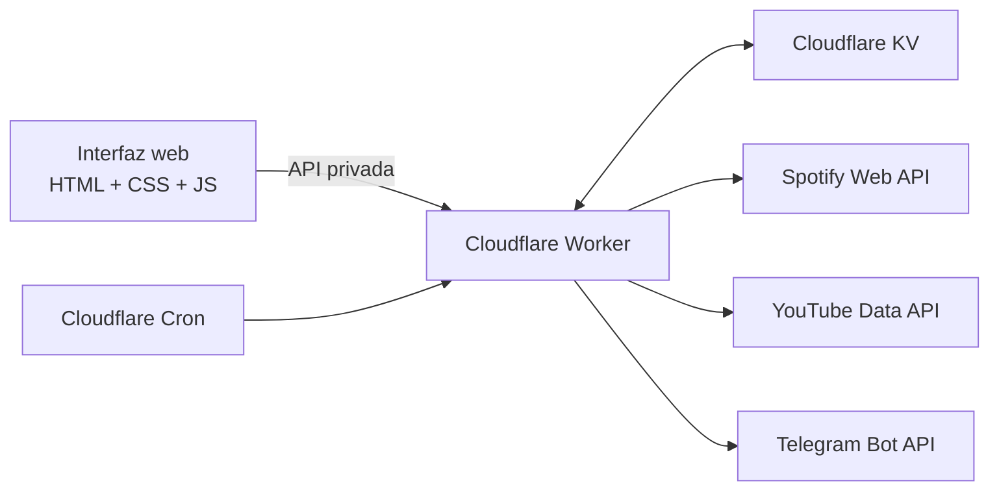
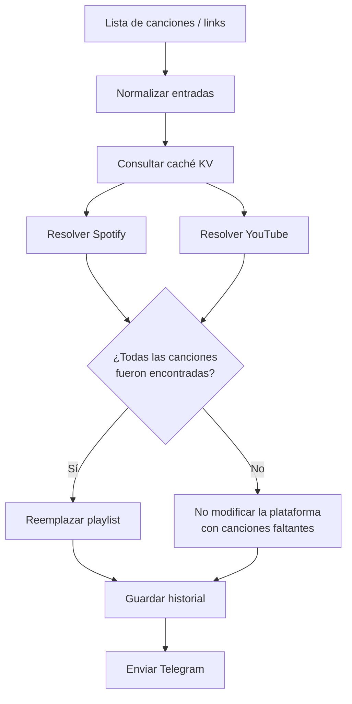

[README_Auto_Playlist.md](https://github.com/user-attachments/files/33137171/README_Auto_Playlist.md)
# Auto Playlist

<p align="center">
  <picture>
    <source media="(prefers-color-scheme: dark)" srcset="public/brand-icon-dark.png">
    <source media="(prefers-color-scheme: light)" srcset="public/brand-icon-light.png">
    
  </picture>
</p>

**Auto Playlist** es una aplicación web para mantener sincronizados repertorios en **Spotify** y **YouTube** desde una sola interfaz.

Permite actualizar playlists manualmente, programar repertorios por semanas, aceptar nombres de canciones o enlaces directos de Spotify/YouTube, ejecutar las programaciones automáticamente y enviar el resultado por **Telegram**.

La aplicación está pensada para ejecutarse sobre **Cloudflare Workers + KV**, aunque también puede desarrollarse y probarse completamente en local.

---

## Estado actual

Versión estable de referencia:

- **Backend / lógica:** V4
- **Interfaz:** UI V5
- **Runtime:** Cloudflare Workers
- **Almacenamiento:** Cloudflare KV
- **Zona horaria:** `America/Bogota`
- **Cron de producción:** cada minuto
- **Spotify:** funcional
- **YouTube:** funcional
- **Telegram:** funcional
- **Programaciones:** funcionales
- **Fecha y hora editables:** funcional
- **Links cruzados Spotify ↔ YouTube:** funcional

> La implementación actual usa un único conjunto de credenciales de Spotify, YouTube y Telegram para toda la instalación. El sistema multiusuario con cuentas y credenciales independientes todavía no está implementado.

---

## Características

### Actualización manual

El usuario puede pegar una canción por línea utilizando cualquiera de estas formas:

```text
Goodness of God - Bethel Music
Way Maker - Sinach
https://open.spotify.com/track/...
https://youtu.be/...
https://www.youtube.com/watch?v=...
spotify:track:...
```

Después puede elegir:

- Spotify
- YouTube
- ambas plataformas

La app intenta resolver todas las canciones y actualiza la playlist correspondiente.

También envía una notificación por Telegram con el resultado.

---

### Programación mensual

Al elegir un mes, la interfaz genera automáticamente sus **4 o 5 lunes**.

Ejemplo:

```text
Semana 1 → lunes 5   → 07:00
Semana 2 → lunes 12  → 07:00
Semana 3 → lunes 19  → 07:00
Semana 4 → lunes 26  → 07:00
```

`07:00` es únicamente el valor sugerido.

Cada tarjeta permite modificar:

- fecha
- hora
- repertorio
- plataformas de destino

Por ejemplo:

```text
Semana 1 → 05/10/2026 → 07:00
Semana 2 → 13/10/2026 → 18:30
Semana 3 → 18/10/2026 → 09:15
Semana 4 → 26/10/2026 → 07:00
```

La ejecución automática utiliza exactamente la **fecha y hora guardadas**.

---

### Telegram

Telegram se utiliza como sistema de confirmación.

Se notifican:

- actualizaciones manuales correctas
- actualizaciones manuales incompletas
- errores manuales
- ejecuciones automáticas correctas
- ejecuciones automáticas incompletas
- errores de ejecución automática

Ejemplo:

```text
🤖 Auto Playlist actualizada automáticamente

📅 martes 13 de octubre de 2026
⏰ 6:30 p. m.
🎵 Canciones: 12
🟢 Spotify: ✅ Actualizado
🔴 YouTube: ✅ Actualizado
```

---

## Arquitectura



En producción no es necesario mantener un computador encendido.

Cloudflare se encarga de:

1. servir la interfaz;
2. ejecutar la API;
3. revisar programaciones;
4. acceder a KV;
5. comunicarse con Spotify, YouTube y Telegram.

---

## Flujo de actualización de una playlist



---

# Cómo se interpretan las canciones

## Entrada de texto

Si el usuario escribe:

```text
Oceans - Hillsong UNITED
```

la app busca esa consulta en las plataformas seleccionadas.

---

## Link de Spotify

Si la entrada es un track de Spotify:

```text
https://open.spotify.com/track/...
```

la aplicación:

1. extrae el Spotify Track ID;
2. consulta ese track exacto;
3. obtiene nombre y artistas;
4. usa esos metadatos para buscar la misma canción en YouTube;
5. guarda ambas coincidencias en caché.

También reconoce:

```text
spotify:track:TRACK_ID
```

---

## Link de YouTube

Si la entrada es un video de YouTube:

```text
https://youtu.be/...
https://www.youtube.com/watch?v=...
https://music.youtube.com/watch?v=...
https://youtube.com/shorts/...
https://youtube.com/embed/...
https://youtube.com/live/...
```

la aplicación:

1. extrae el YouTube Video ID;
2. lee los metadatos del video;
3. obtiene título y canal;
4. limpia términos habituales como `official`, `video`, `lyrics`, `audio`, etc.;
5. busca la canción equivalente en Spotify.

---

## Links no admitidos como canción

El sistema espera enlaces a una **canción/track o video individual**.

No deben usarse como entrada de canción:

- playlist de Spotify
- álbum de Spotify
- artista de Spotify
- playlist de YouTube
- canal de YouTube

La aplicación intenta detectar estos casos y devuelve un mensaje de error en lugar de realizar una búsqueda ambigua.

---

# Regla de seguridad para las playlists

Auto Playlist evita dejar una playlist parcialmente actualizada.

Para cada plataforma seleccionada:

- si **todas** las canciones fueron resueltas, la playlist puede actualizarse;
- si existe al menos una canción faltante, esa plataforma no se reemplaza.

Las plataformas se evalúan de forma independiente.

Ejemplo:

```text
Spotify → 10/10 encontradas → se actualiza
YouTube → 9/10 encontradas  → no se actualiza
```

El resultado general se marca como incompleto y se registra en el historial.

---

# Spotify

## Autenticación

Spotify utiliza OAuth mediante:

```text
SPOTIFY_CLIENT_ID
SPOTIFY_CLIENT_SECRET
SPOTIFY_REFRESH_TOKEN
```

El Worker usa el `refresh_token` para obtener un access token cuando lo necesita.

---

## Actualización de la playlist

La lógica:

1. lee la playlist actual;
2. compara el orden actual con el deseado;
3. si ya son iguales, no realiza cambios innecesarios;
4. si son diferentes, reemplaza el contenido;
5. soporta más de 100 elementos mediante bloques adicionales.

Variable de destino:

```text
SPOTIFY_PLAYLIST_ID
```

---

# YouTube

## Autenticación

YouTube utiliza OAuth mediante:

```text
YOUTUBE_CLIENT_ID
YOUTUBE_CLIENT_SECRET
YOUTUBE_REFRESH_TOKEN
```

El Worker obtiene un access token con el refresh token.

---

## Actualización de la playlist

La implementación intenta reducir operaciones innecesarias:

1. lee los elementos actuales;
2. conserva el prefijo que ya coincide con el repertorio deseado;
3. elimina únicamente los elementos restantes;
4. agrega los nuevos videos en orden.

Las eliminaciones se realizan **secuencialmente** para evitar errores de concurrencia de la API.

Existe reintento automático para respuestas como:

```text
409
429
500
502
503
504
```

con espera progresiva entre intentos.

Variable de destino:

```text
YOUTUBE_PLAYLIST_ID
```

---

# Caché

Las coincidencias entre canciones y plataformas se almacenan en KV para evitar repetir búsquedas.

Tipos de claves:

```text
match:v2:spotify:<TRACK_ID>
match:v2:youtube:<VIDEO_ID>
match:v2:text:<SHA256>
```

Esto evita que distintos enlaces compartan accidentalmente la misma entrada de caché.

Duración aproximada:

```text
180 días
```

La caché puede contener:

- consulta original
- coincidencia Spotify
- coincidencia YouTube
- fecha de actualización

---

# Historial

Cada actualización genera una entrada:

```text
history:<timestamp>:<uuid>
```

Se registra de forma compacta:

- fecha de finalización
- número de canciones
- ejecución manual o programada
- fecha programada, cuando aplica
- estado Spotify
- estado YouTube
- canciones faltantes
- mensaje de resultado

El historial se conserva aproximadamente:

```text
90 días
```

La interfaz muestra las últimas ejecuciones.

---

# Programaciones

## Modelo

Las programaciones nuevas se almacenan con una clave basada en:

```text
schedule:<YYYY-MM>:<slot>
```

Ejemplo:

```text
schedule:2026-10:1
schedule:2026-10:2
schedule:2026-10:3
schedule:2026-10:4
```

Un objeto de programación contiene, entre otros:

```json
{
  "id": "2026-10:2",
  "planMonth": "2026-10",
  "slot": 2,
  "defaultDate": "2026-10-12",
  "date": "2026-10-13",
  "time": "18:30",
  "songs": [
    "Canción - Artista"
  ],
  "platforms": {
    "spotify": true,
    "youtube": true
  },
  "executedAt": null,
  "lastAttemptLocal": null,
  "lastError": null
}
```

---

## Lunes automáticos

Al cargar un mes, la app calcula todos sus lunes.

Estos valores sirven como propuesta inicial:

```text
fecha = lunes correspondiente
hora  = 07:00
```

La fecha y la hora pueden cambiarse libremente antes de guardar.

---

## Semana vacía

Si una semana no contiene canciones:

- no se crea una programación;
- si existía una programación para ese slot, se elimina al guardar el mes.

---

## Modificar una programación ejecutada

Si se cambia cualquiera de estos datos:

- fecha
- hora
- canciones
- plataformas

la programación vuelve a quedar pendiente.

Esto permite reutilizar una tarjeta después de modificar su contenido.

---

# Ejecución automática

En producción, `wrangler.jsonc` usa:

```json
"triggers": {
  "crons": ["* * * * *"]
}
```

El Worker se activa cada minuto.

Eso **no significa que las playlists se actualicen cada minuto**.

Cada revisión comprueba:

```text
¿la programación está pendiente?
¿la fecha es hoy?
¿la hora programada ya llegó?
```

Solo entonces se ejecuta.

---

## Importante: no hay recuperación automática al día siguiente

Una programación normal solo se ejecuta cuando:

```text
schedule.date === fecha actual
```

Si el sistema no pudo revisarla durante todo ese día, no se ejecuta automáticamente al día siguiente.

---

## Reintentos por error técnico

Cuando una ejecución lanza un error técnico, se guarda:

```text
lastAttemptLocal
lastError
```

El sistema permite otro intento después de aproximadamente:

```text
10 minutos
```

mientras siga siendo la misma fecha programada.

Esto evita reintentos continuos cada minuto.

---

## Coincidencias faltantes

Si la ejecución sí termina, pero alguna canción no pudo resolverse:

- la plataforma afectada no se reemplaza;
- se envía Telegram indicando que la ejecución fue incompleta;
- la programación se considera atendida y queda marcada con `executedAt`.

No se repite indefinidamente por una canción que no existe o no pudo encontrarse.

---

# Ejecución manual de una programación

Existe una ruta de prueba para ejecutar una programación concreta sin esperar a su fecha/hora.

Esto se utiliza principalmente para pruebas.

Ejemplo conceptual:

```text
POST /api/schedules/2026-10%3A2/run
```

La ejecución sigue usando el repertorio y las plataformas de esa programación.

---

# API

Todas las rutas `/api/*`, excepto `/api/health`, requieren:

```http
x-app-key: <APP_PASSWORD>
```

| Método | Ruta | Función |
|---|---|---|
| `GET` | `/api/health` | Estado básico del Worker |
| `GET` | `/api/status` | Configuración disponible y estado de integraciones |
| `POST` | `/api/update` | Actualización manual |
| `GET` | `/api/history` | Últimas actualizaciones |
| `GET` | `/api/schedules` | Lista de programaciones |
| `GET` | `/api/schedules?month=YYYY-MM` | Programaciones de un mes |
| `POST` | `/api/schedules/month` | Guardar plan mensual |
| `POST` | `/api/schedules/:id/run` | Ejecutar una programación manualmente |
| `DELETE` | `/api/schedules/:id` | Eliminar programación |
| `POST` | `/api/run-due` | Revisar y ejecutar programaciones vencidas |

---

# Autenticación de la aplicación

La interfaz no expone directamente las credenciales de Spotify, YouTube o Telegram.

El usuario introduce:

```text
APP_PASSWORD
```

La interfaz envía esa clave en:

```http
x-app-key
```

El Worker compara la clave recibida con el secreto configurado utilizando una comparación basada en SHA-256.

> `APP_PASSWORD` protege el acceso a esta instalación, pero no sustituye un sistema completo de usuarios, sesiones, roles, recuperación de contraseña o MFA.

---

# Variables de entorno

Crear un archivo local:

```text
.dev.vars
```

Contenido esperado:

```dotenv
APP_PASSWORD=

SPOTIFY_CLIENT_ID=
SPOTIFY_CLIENT_SECRET=
SPOTIFY_REFRESH_TOKEN=
SPOTIFY_PLAYLIST_ID=

YOUTUBE_CLIENT_ID=
YOUTUBE_CLIENT_SECRET=
YOUTUBE_REFRESH_TOKEN=
YOUTUBE_PLAYLIST_ID=

TELEGRAM_BOT_TOKEN=
TELEGRAM_CHAT_ID=
```

También existe:

```text
.dev.vars.example
```

como plantilla sin secretos.

## Nunca subir `.dev.vars`

Agregarlo a `.gitignore`:

```gitignore
.dev.vars
.env
.env.*
node_modules/
.wrangler/
```

Los secretos reales no deben estar en GitHub.

---

# Estructura del repositorio

```text
auto-playlist/
├── public/
│   ├── index.html
│   ├── styles.css
│   ├── app.js
│   ├── brand-icon-dark.png
│   ├── brand-icon-light.png
│   ├── favicon.png
│   └── apple-touch-icon.png
│
├── scripts/
│   └── local-scheduler.mjs
│
├── src/
│   ├── index.js
│   └── lib/
│       ├── playlists.js
│       ├── schedules.js
│       ├── spotify.js
│       ├── youtube.js
│       ├── telegram.js
│       └── utils.js
│
├── .dev.vars.example
├── .gitignore
├── package.json
├── wrangler.jsonc
└── README.md
```

---

# Responsabilidad de cada archivo

## `src/index.js`

Punto de entrada del Worker.

Se encarga de:

- servir `/api/*`;
- proteger las rutas;
- recibir actualizaciones manuales;
- administrar programaciones;
- exponer historial;
- llamar a Telegram en flujo manual;
- ejecutar `runDueSchedules()` desde Cron.

---

## `src/lib/playlists.js`

Orquestador principal de repertorios.

Se encarga de:

- limpiar canciones;
- identificar links;
- consultar caché;
- resolver Spotify;
- resolver YouTube;
- cruzar enlaces entre plataformas;
- decidir si una playlist puede actualizarse;
- llamar al reemplazo de playlists;
- guardar historial.

---

## `src/lib/spotify.js`

Contiene:

- refresh de OAuth;
- búsqueda de tracks;
- lectura de playlist;
- reemplazo de playlist.

---

## `src/lib/youtube.js`

Contiene:

- refresh de OAuth;
- búsqueda de videos;
- lectura de playlist;
- actualización ordenada;
- eliminación secuencial;
- reintentos ante errores temporales.

---

## `src/lib/schedules.js`

Contiene:

- cálculo de lunes;
- guardado del plan mensual;
- fechas y horas editables;
- listado de programaciones;
- ejecución automática;
- control de reintentos;
- ejecución manual de prueba;
- estado de ejecución;
- Telegram para programaciones.

---

## `src/lib/telegram.js`

Abstracción sencilla sobre:

```text
Telegram Bot API / sendMessage
```

Utiliza:

```text
TELEGRAM_BOT_TOKEN
TELEGRAM_CHAT_ID
```

---

## `src/lib/utils.js`

Funciones compartidas:

- respuestas JSON;
- limpieza de canciones;
- normalización de texto;
- scoring de coincidencias;
- extracción de Spotify Track ID;
- extracción de YouTube Video ID;
- detección de links no válidos;
- SHA-256;
- comparación de clave;
- fecha/hora local;
- `fetchJson`;
- control de concurrencia;
- limpieza de secretos.

---

## `public/`

Frontend estático.

La UI V5 contiene:

- pantalla de login;
- sidebar;
- navegación por secciones;
- estado de conexiones;
- actualización manual;
- programador mensual;
- fecha/hora editable;
- estado e historial;
- diseño responsive;
- iconos de marca;
- degradado ambiental interactivo que responde al puntero.

La UI V5 no modifica la lógica del backend.

---

# Desarrollo local

## Requisitos

- Node.js moderno con `fetch`
- npm
- cuenta de Spotify Developer
- proyecto OAuth de Google/YouTube
- bot de Telegram
- cuenta de Cloudflare para despliegue

Instalar:

```bash
npm install
```

En Windows PowerShell, si la política de ejecución bloquea `npm.ps1`, puede usarse:

```powershell
npm.cmd install
```

---

## Iniciar Worker local

```bash
npm run dev:local
```

Equivale a ejecutar Wrangler en:

```text
http://127.0.0.1:8790
```

---

## Programaciones automáticas en local

Wrangler local no sustituye por sí solo el Cron de producción.

Abrir una segunda terminal:

```bash
npm run scheduler:local
```

El script:

```text
scripts/local-scheduler.mjs
```

llama a:

```text
POST /api/run-due
```

cada minuto.

Por tanto, para automatización local deben permanecer abiertos:

```text
PC
Worker local
scheduler:local
```

---

# Cloudflare KV

Binding utilizado:

```text
PLAYLIST_STORE
```

KV almacena principalmente:

```text
schedule:*   → programaciones
match:*      → caché de coincidencias
history:*    → historial
```

El KV local de Wrangler y el KV de producción son independientes.

Una programación creada en local no aparece automáticamente en producción.

---

# Configuración de Cloudflare

Crear el namespace si todavía no existe:

```bash
npx wrangler kv namespace create PLAYLIST_STORE
```

Asignar su ID en:

```text
wrangler.jsonc
```

Ejemplo:

```json
"kv_namespaces": [
  {
    "binding": "PLAYLIST_STORE",
    "id": "TU_KV_NAMESPACE_ID"
  }
]
```

No reutilizar IDs de ejemplo de otro proyecto.

---

# Subir secretos a producción

La forma rápida:

```bash
npx wrangler secret bulk .dev.vars
```

En Windows:

```powershell
npx.cmd wrangler secret bulk .dev.vars
```

Comprobar los nombres:

```bash
npx wrangler secret list
```

Los valores no deben imprimirse ni almacenarse en el repositorio.

---

# Despliegue

```bash
npm run deploy
```

o:

```bash
npx wrangler deploy
```

En Windows:

```powershell
npx.cmd wrangler deploy
```

Cloudflare publicará:

- Worker
- assets de `/public`
- bindings
- Cron Trigger

---

## Si se cambia el nombre del Worker

Los secretos pertenecen al Worker correspondiente.

Al cambiar el `name` de `wrangler.jsonc`, el nuevo Worker puede no tener los secretos del anterior.

Volver a ejecutar:

```bash
npx wrangler secret bulk .dev.vars
```

si la web muestra errores como:

```text
Falta configurar APP_PASSWORD.
```

---

# Producción

Una vez desplegado correctamente:

```text
Cloudflare
   ↓
revisa cada minuto
   ↓
programación vencida
   ↓
Spotify + YouTube
   ↓
Telegram
```

No es necesario mantener:

```text
npm run dev:local
npm run scheduler:local
```

abiertos.

Tampoco es necesario que el computador permanezca encendido.

---

# Prueba de humo recomendada

Después de un cambio importante:

1. iniciar sesión;
2. actualizar 1–2 canciones manualmente;
3. confirmar Spotify;
4. confirmar YouTube;
5. confirmar Telegram;
6. crear una programación para algunos minutos adelante;
7. esperar a que Cloudflare la ejecute;
8. revisar el historial.

Resultado esperado:

```text
Login ✅
Spotify ✅
YouTube ✅
Links cruzados ✅
Telegram ✅
Programación automática ✅
Historial ✅
```

---

# Comprobación de sintaxis

Antes de desplegar:

```bash
node --check public/app.js
node --check src/index.js
node --check src/lib/schedules.js
node --check src/lib/playlists.js
node --check src/lib/utils.js
node --check src/lib/spotify.js
node --check src/lib/youtube.js
node --check src/lib/telegram.js
```

---

# Diseño de la UI

La interfaz actual usa una estética:

- azul marino / azul profundo;
- bloques sólidos;
- sombras suaves;
- bordes redondeados;
- tipografía sans serif;
- bajo nivel de transparencia;
- icono de archivo + repetir;
- degradado ambiental interactivo;
- responsive para escritorio, tablet y móvil.

Archivos visuales principales:

```text
public/brand-icon-dark.png
public/brand-icon-light.png
public/favicon.png
public/apple-touch-icon.png
```

---

# Limitaciones actuales

La versión actual no incluye todavía:

- registro público de usuarios;
- cuentas múltiples;
- OAuth individual por usuario;
- playlists diferentes por usuario;
- panel de administración;
- recuperación de contraseña;
- roles/permisos;
- edición avanzada individual de una programación mediante una ruta dedicada;
- pruebas automatizadas completas;
- base de datos relacional.

El objetivo actual es una instalación privada/centralizada con un único conjunto de integraciones.

---

# Posibles evoluciones

Sin modificar la base estable, el proyecto puede crecer hacia:

- multiusuario;
- conexión OAuth desde la propia interfaz;
- selección de varias playlists;
- repertorios reutilizables;
- duplicar/copiar semanas;
- búsqueda asistida de canciones;
- editor de coincidencias antes de publicar;
- notificaciones configurables;
- métricas de ejecuciones;
- auditoría y logs;
- diferentes zonas horarias;
- reglas de recurrencia adicionales.

---

# Seguridad

Recomendaciones:

- nunca publicar `.dev.vars`;
- nunca compartir refresh tokens;
- utilizar una contraseña fuerte para `APP_PASSWORD`;
- mantener el repositorio privado mientras contenga información sensible;
- rotar secretos si alguno se expone;
- revisar qué Worker tiene Cron activo antes de eliminar versiones antiguas;
- evitar dos Workers activos apuntando a la misma automatización si ambos tienen Cron configurado.

---

# Resumen del funcionamiento

```text
USUARIO
   │
   ├── Actualizar ahora
   │      │
   │      ├── texto / Spotify URL / YouTube URL
   │      ↓
   │   resolver canciones
   │      ↓
   │   Spotify + YouTube
   │      ↓
   │   historial
   │      ↓
   │   Telegram
   │
   └── Programar mes
          │
          ├── 4 o 5 lunes automáticos
          ├── fecha editable
          ├── hora editable
          └── repertorio por semana
                 ↓
          Cloudflare Cron
                 ↓
          ejecución programada
                 ↓
          Spotify + YouTube
                 ↓
          historial + Telegram
```

---

## Licencia

Actualmente el proyecto no define una licencia pública.

Si el repositorio se hace público, se recomienda añadir un archivo `LICENSE` acorde con el uso que se quiera permitir.

---

## Nota de mantenimiento

La base considerada estable es:

```text
Backend V4 + UI V5
```

Al añadir nuevas funciones, se recomienda mantener separadas:

```text
Lógica de integraciones
Lógica de programación
Interfaz
```

para no afectar Spotify, YouTube, Telegram o Cron cuando el cambio sea únicamente visual.
